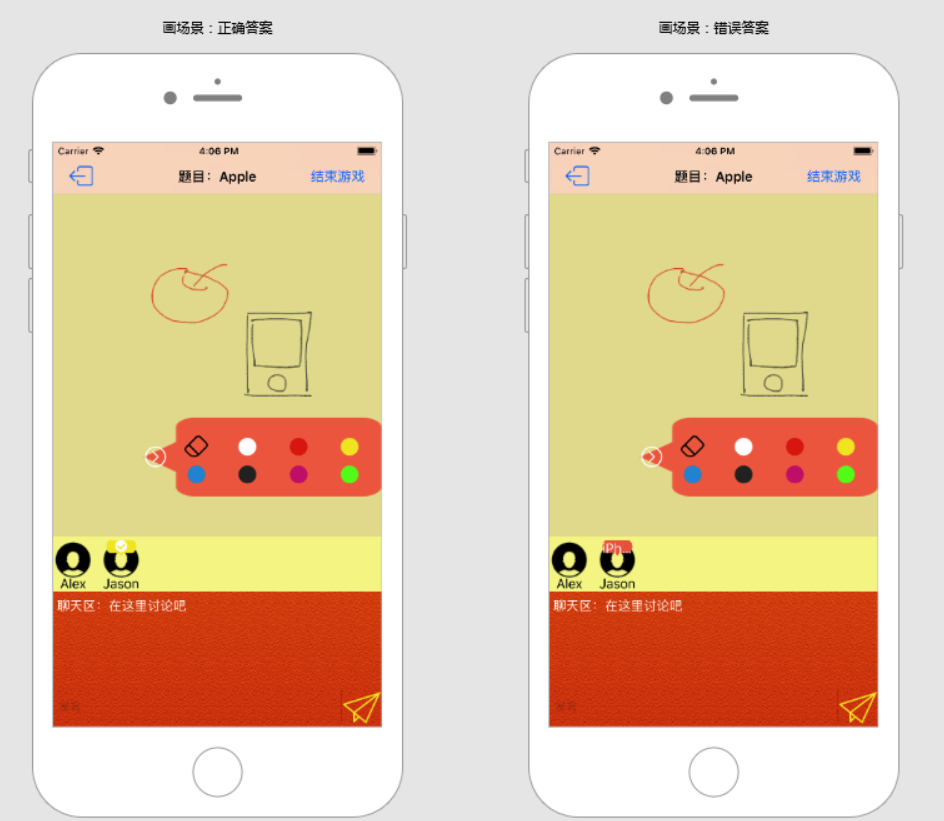

# Let-s-Draw
《移动互联网应用开发》课程大作业
## 运行环境
客户端代码使用XCode9+Swift4开发。 
后端使用NodeJs+express框架开发了一个本地服务器。需要安装mongodb和websocket模块。 
> brew install mongodb 
npm install websocket 
mongo

运行客户端前前需要先开启服务器：
> cd express-let-s-draw/
npm start

因为使用了第三方框架，编译客户端代码时，可能会出现error，在项目路径下：
>brew install carthage
carthage update

## 功能说明
下面按照使用流程对各个场景进行说明。 
注：以下的示意图是在真机上截图后使用Mockplus重新整理得到的。 

### 登录
一开始玩家输入昵称，“进入游戏”按钮只有当输入框中不为空时才为可用状态。 
在这里可以点击头像后进入相册选择头像图片。 
注：因为时间关系，服务器端没有实现图片服务器的功能，所以其他场景里，所有玩家的头像都是默认头像。 
 
点击“进入游戏”按钮后，向服务器发送消息，得到该玩家的ID。若没有得到ID，则会弹出一个AlertView提示连接失败。

### 选择游戏房间
玩家的信息显示在左上角。可以选择创建一个房间或者搜索一个已有的房间。 
 
搜索房间可能会失败。 
 
搜索成功或者创建房间后，即可进入该房间。

### 准备
房间里的当前玩家会即时显示在一个collectionView中. 
 
并且下方有一个聊天区，玩家发送的信息会即时发送给该房间的玩家。
 
点击退出按钮即可退出该房间。点击“邀请”可输入玩家ID发出邀请。 
 
 
当任何一个玩家按下“准备”按钮后，该房间进入游戏。 

### 等待游戏开始
 
从服务器获取本局游戏相关的信息，有一个进度条动画。

### 游戏场景
一局游戏有一个画手，其余人负责猜。玩家列表与聊天区的功能和前面一样。 
 
##### 画板
画手可以在画板上作画。使用画笔工具栏可改变颜色或者选择橡皮擦，点击箭头可展开或收起画笔工具栏。 
房间内玩家的画板是实时同步的。 
 
##### 回答
猜的人点击回答按钮，在弹出的alertView中作答。 
 
回答内容会在玩家列表中显示出来。若回答错误则显示回答的内容，正确则显示一个勾。 
 
 
##### 退出
想要退出时会弹出alertView询问是否确认退出。
 
 
画手也可以选择结束本局游戏，这时其他玩家会收到游戏结束的信息。确认后会回到准备场景。 
 

## 不足之处
一开始选择这个项目的时候，主要是考虑到这个项目有一定的复杂度，可以把本课程上学到的东西大部分都用上。但是实际开发的时候，网络通信占据了大部分的时间和精力，所以有些方面还是有不足。
1. 基础功能还可以更完善。主要是受限于后端，比如图片服务器等；
2. UI可以更美观。一方面是时间原因，另一方面是不懂UI设计，在设计界面时实在有些头疼，以及选取背景图片时总是找不到合适的，结果开头背景图片是low poly风格的，后面的背景又是拟物的。
3. 游戏性还有待提升。目前的游戏流程还比较单一。
4. 玩家之间的交互不方便。玩家间的交流也只能使用聊天区的文字信息。以及，因为没有账号管理的系统，其实玩家之间通过系统随机ID交流是基本不可能的，就是说“准备”界面的“邀请”按钮其实实用性不高。
5. 原本预期的社交小游戏合集框架，还有语音聊天系统，因为工作量的原因被放弃了。

## Reference
### 画板功能

[1] [Swift 全功能的绘图板开发](http://blog.csdn.net/zhangao0086/article/details/43836789) 
[2] [Swift - Core Graphics绘图框架详解1（绘制线条）](http://www.hangge.com/blog/cache/detail_1437.html) 

### 网络通信

[1] [使用URLSession同步获取数据（通过添加信号量）](http://www.hangge.com/blog/cache/detail_816.html) 
[2] [[MongoDB]Update更新数据](http://blog.csdn.net/sunnyyoona/article/details/52420210) 
[3] [Swift - HTTP网络操作库Alamofire使用详解1](http://www.hangge.com/blog/cache/detail_970.html) 
[4] [WebSockets on iOS with Starscream](https://www.raywenderlich.com/143874/websockets-ios-starscream)

### UI

[1] [swift 实现键盘弹出视图上移](http://blog.csdn.net/eiamor/article/details/71515300) 
[2] [UIAlertViewController的使用](https://www.jianshu.com/p/1e6b0830b50d) 

### 开源框架

[1] [Alamofire](https://github.com/Alamofire/Alamofire) 
[2] [Starscream](https://github.com/daltoniam/Starscream) 
[3] [TextFieldEffects](https://github.com/raulriera/TextFieldEffects)

## iOS学习笔记
课程学习和开发过程中遇到的一些问题和思考，记录在这里。
***
1. **GCD队列的优先级** 
iOS上：[Energy Efficiency Guide for iOS Apps - Prioritize Work with Quality of Service Classes](https://developer.apple.com/library/content/documentation/Performance/Conceptual/EnergyGuide-iOS/PrioritizeWorkWithQoS.html#//apple_ref/doc/uid/TP40015243-CH39-SW1) 
对于Mac上的说明跟iOS的基本一致：[Energy Efficiency Guide for Mac Apps - Prioritize Work at the Task Level](https://developer.apple.com/library/content/documentation/Performance/Conceptual/power_efficiency_guidelines_osx/PrioritizeWorkAtTheTaskLevel.html#//apple_ref/doc/uid/TP40013929-CH35-SW1)
***
2. **Main Thread Checker** 
在启动app时（at app launch），自动将只能在主线程上运行的代码替换成带有检查（check）的版本，如果是在主线程上，就不会进入这个判断语句块。 
在下载图片的例子中，如果在completionHandler中，也就是在非主线程中更新imageView，会在终端输出调试信息，一段时间后才会显示图片。 
所以，自动加的这个check里面，应该就只是一些负责输出信息的代码，这个操作还是会进行，程序也不会崩溃，只是交互不太及时。 
运行一个macOS app，只要有动态库文件/Applications/Xcode.app/Contents/Developer/usr/lib/libMainThreadChecker.dylib就行，不需要重新编译程序。 
占用资源很少，所以Xcode上一般自动开启主线程检查。
***
3. **Operation** 
- **NSInvocationOperation & BlockOperation** 
Operation是一个抽象类，不能直接使用。 
NSInvocationOperation使用 selector 回调并可以传递参数进去，BlockInvocation是使用 Block。如果想要使用多线程异步操作，则应该选择   NSBlockOperation。 
事实上，NSInvocationOperation在swift中是不可用的。 
- **OperationQueue** 
被cancel的operation，依赖于它的所有operation都会被cancel；如果被cancel的这个operation已经开始了，则会继续运行下去，但是‘isCancelled’还是会变为true。
***
4. **NavigationBar不显示** 
如果当前View的NavigationController没有入口，则编译器会警告，并且对应的NavigationBar就（可能）不会显示。 
至少要有一个segue指向NavigationController，可以通过它的topViewController来访问对应的view。
***
5. **performSegueWithIdentifier 不跳转** 
[iOS 开发中手动 performSegueWithIdentifier 不生效的解决办法](https://lvwenhan.com/ios/424.html)
> iOS 视图控制对象的生命周期如下： 
init－初始化程序 
viewDidLoad－加载视图 
viewWillAppear－UIViewController对象的视图即将加入窗口时调用； 
viewDidApper－UIViewController对象的视图已经加入到窗口时调用； 
viewWillDisappear－UIViewController对象的视图即将消失、被覆盖或是隐藏时调用； 
viewDidDisappear－UIViewController对象的视图已经消失、被覆盖或是隐藏时调用； 
viewVillUnload－当内存过低时，需要释放一些不需要使用的视图时，即将释放时调用； 
viewDidUnload－当内存过低，释放一些不需要的视图时调用。 

如果在 viewDidLoad 时就启动 Segue 的话，依然会被后来填充的视图覆盖，要在视图载入完成以后的 viewDidAppear 中启动 Segue.
***
6. **Any类型** 
在斯坦福教程中有详细说明。 
***
7. **json数据** 
未完全解决 
将字典类型转为json类型，作为post的参数 
发送{roomid:1001} 
变成{'{\n "roomId" : 1001\n}': ''} 
暂时把参数都放在URL里，但是没法传中文、空格等特殊字符 
可以采用Alamofire，传参数很方便。 
将字典转为data，在后台解析： 

客户端：
>let parameters:[String: Any] = [
"tt": "ss",
"aa": "bb"
]
let data = try? JSONSerialization.data(withJSONObject: parameters, options: [])
socket.write(data: data!)

后台：
>var dic = JSON.parse(message.binaryData);
console.log(dic.aa);

***
8. **OperationQueue中的operation无法取消** 
其实该operation的isCancelled已经为true，但是不知道什么原因还在运行。 
在取消后手动记录下取消状态，在operation中检查这个值，手动终止该任务。 
更新： 
[Documentation-operation](https://developer.apple.com/documentation/foundation/operation#1661262)
>Canceling an operation does not actively stop the receiver’s code from executing. An operation object is responsible for calling this method periodically and stopping itself if the method returns true.

***
9. **Web Socket** 
心跳包：调试的时候发现，如果客户端程序停在断点处，大约30秒后socket连接会自动断开，但是如果在运行时，哪怕长时间无任何操作也不会断开。 
connect，write等socket操作，并不是在语句处立即执行的，或者说相应的事件不会立即收到。 
可能与使用的web socket框架（Starscream）的实现方式有关。 
***
10. **delegate** 
问题：在场景1中，设置socket收到message后perform segue到场景2，并且把socket传值给场景2中的socket，但是没有重新设置socket.delegate。结果perform segue被调用了两次，在present场景2的过程中出现了错误。

解决：把场景2中的socket的delegate设置为nil或者self即可。问题原因暂时不清楚。
***
11. **unwind segue**  
哪怕起点和目标view controller在不同的navigation controller里，也是可以直接用unwind来跳转的，只要目标view controller中实现了目标action。 
一个confusing的事情是，在向上找目标view controller的过程中，途径的view也会被加载，甚至写在viewDidAppear中的方法也会被调用一遍，但是实际运行时看不到这些view（来不及看到？），但最终还是会跳转到目标view上。 
***
